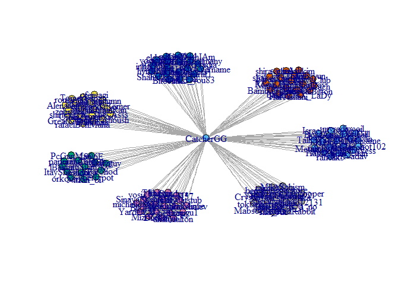
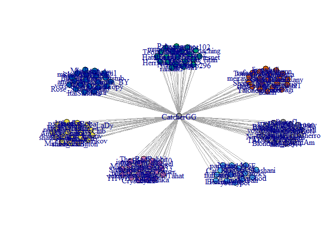

Analyze Twitter Network
================
GuyGo and Ofri Masad

Network Analysis:
=================

### Reading the data

The data is a csv files containing the graph edges of GuyGo twitter followers. And edge is represented by couple: {From, To}

``` r
head(ga.data)
```

    ##            From    To
    ## 1      areldoga 1996E
    ## 2      ImahAbah 1996E
    ## 3  ItayShoshani 1996E
    ## 4      papering 1996E
    ## 5     orkoren34 1996E
    ## 6 MattiSvatizky 1996E

### Data exploration:

#### Followers:

We've fetched information from CatcherGG\[Guy Gonen\] and his 134 followers. For each follower we fetched up to 200 possible followers and then dropped people which are not following CatcherGG In order to not exceed 200 nodes.

``` r
V(g)$name
```

    ##   [1] "areldoga"        "ImahAbah"        "ItayShoshani"   
    ##   [4] "papering"        "orkoren34"       "MattiSvatizky"  
    ##   [7] "yberrypot"       "Nitzan_bi"       "IParohod"       
    ##  [10] "lBenua"          "Cat_Blog"        "PcGunMan"       
    ##  [13] "1996E"           "fluffyguy"       "myradiocoil"    
    ##  [16] "HerrNadav"       "TallyMa1"        "NettaBeiton"    
    ##  [19] "krembo296"       "Teo_Galvan"      "DanDilll"       
    ##  [22] "Avshalom_eitan"  "BoazAri"         "Catmoviesnet"   
    ##  [25] "HatulZoef"       "rahelik5"        "Israel_Coaching"
    ##  [28] "Palavragame"     "GraphyNess"      "honeysin42"     
    ##  [31] "favstar_bot102"  "mmmmichal"       "Metalit123"     
    ##  [34] "301183"          "naknikim"        "PaRaDoX_LaDy"   
    ##  [37] "shaulhayun"      "shira_chen_"     "revetalosh"     
    ##  [40] "EliranTamsuT"    "ShovalBitton"    "sapirAsh"       
    ##  [43] "DimaSurikov"     "shakedbu"        "HaiTanami"      
    ##  [46] "talkaza"         "BambaBoba"       "DaveClub"       
    ##  [49] "4Trillian"       "balariv"         "SofiZach"       
    ##  [52] "RoeiR"           "AmirOz"          "Mimoola21"      
    ##  [55] "SinayaShemesh"   "Vinethropy"      "funnycatstub"   
    ##  [58] "michalidan13"    "shanigu1"        "yosi25111"      
    ##  [61] "MizrRene"        "amihaialfon"     "barakshalev"    
    ##  [64] "Yarden_BY"       "932_54"          "doronily"       
    ##  [67] "BikLihi"         "Rose_ShaMimie"   "IvgiH"          
    ##  [70] "yoav1982b"       "Duckinyu"        "TShagrir"       
    ##  [73] "ItaiSanders"     "vered457"        "ofersagi"       
    ##  [76] "TomerSaban"      "MilProvencio"    "AlenaJany"      
    ##  [79] "YalondaRomer"    "romantif1"       "The_Asss"       
    ##  [82] "liranohali"      "lidanh"          "CohenRan"       
    ##  [85] "OrianZinger"     "yali3ma"         "_SoyCD"         
    ##  [88] "ShafirYael"      "zebrale"         "rafaelBenMuha"  
    ##  [91] "shirley__h"      "GreatKubani"     "meiravashoush"  
    ##  [94] "Shiranumn"       "talmaXO"         "The_RadRabbit"  
    ##  [97] "YHWH_Adonai"     "gavri33"         "BlueEyes0_0"    
    ## [100] "that_is_a_no"    "daniel66321302"  "elmlak"         
    ## [103] "Crystalyani"     "bemileil"        "sagiangel"      
    ## [106] "MabsooTahat"     "sh00shka"        "whileLooper"    
    ## [109] "natan12131"      "ismystore"       "Shalvatta"      
    ## [112] "MikeSchism"      "shaybut"         "tokbekist"      
    ## [115] "yogigueta"       "nerya_elul"      "NirOvadia"      
    ## [118] "BitcoinIL"       "TALYLAVY"        "Would_you83"    
    ## [121] "hymerus"         "inbarm92"        "natan0044"      
    ## [124] "Long_Username"   "KimDashIAm"      "WilliamRodgers" 
    ## [127] "KingozaurBot1"   "spesSelene"      "Blondinie_boy"  
    ## [130] "yehudasherro"    "Shahaf1410"      "polinaraf1"     
    ## [133] "MoradMuslimany"  "eldars1990"      "CatcherGG"

#### Number of Connections between followers and followers of followers:

``` r
summary(g)
```

    ## IGRAPH UN-- 135 1363 -- 
    ## + attr: name (v/c)

### Data-visualization:

#### Basic representation:

``` r
g$layout <- layout.fruchterman.reingold(g)
plot(g)
```

<!-- --> \#\#\#\# Basic representation without names \[We'll continue without names from now on\]:

``` r
V(g)$label <- NA 
g$layout <- layout.fruchterman.reingold(g)
plot(g)
```

<!-- --> \#\#\#\# Degree score:

``` r
degr.score <- degree(g)
degr.score
```

    ##        areldoga        ImahAbah    ItayShoshani        papering 
    ##              14              14              13              14 
    ##       orkoren34   MattiSvatizky       yberrypot       Nitzan_bi 
    ##              14              14              14              14 
    ##        IParohod          lBenua        Cat_Blog        PcGunMan 
    ##              14              13              14              14 
    ##           1996E       fluffyguy     myradiocoil       HerrNadav 
    ##              14              14              20              20 
    ##        TallyMa1     NettaBeiton       krembo296      Teo_Galvan 
    ##              20              20              20              20 
    ##        DanDilll  Avshalom_eitan         BoazAri    Catmoviesnet 
    ##              20              20              20              20 
    ##       HatulZoef        rahelik5 Israel_Coaching     Palavragame 
    ##              20              20              20              20 
    ##      GraphyNess      honeysin42  favstar_bot102       mmmmichal 
    ##              20              20              20              20 
    ##      Metalit123          301183        naknikim    PaRaDoX_LaDy 
    ##              20              20              20              20 
    ##      shaulhayun     shira_chen_      revetalosh    EliranTamsuT 
    ##              20              20              20              20 
    ##    ShovalBitton        sapirAsh     DimaSurikov        shakedbu 
    ##              20              20              20              20 
    ##       HaiTanami         talkaza       BambaBoba        DaveClub 
    ##              20              20              20              20 
    ##       4Trillian         balariv        SofiZach           RoeiR 
    ##              20              20              20              20 
    ##          AmirOz       Mimoola21   SinayaShemesh      Vinethropy 
    ##              20              20              20              20 
    ##    funnycatstub    michalidan13        shanigu1       yosi25111 
    ##              20              20              20              20 
    ##        MizrRene     amihaialfon     barakshalev       Yarden_BY 
    ##              20              20              20              20 
    ##          932_54        doronily         BikLihi   Rose_ShaMimie 
    ##              20              20              20              20 
    ##           IvgiH       yoav1982b        Duckinyu        TShagrir 
    ##              20              20              20              20 
    ##     ItaiSanders        vered457        ofersagi      TomerSaban 
    ##              20              20              19              20 
    ##    MilProvencio       AlenaJany    YalondaRomer       romantif1 
    ##              20              20              20              20 
    ##        The_Asss      liranohali          lidanh        CohenRan 
    ##              20              20              20              20 
    ##     OrianZinger         yali3ma          _SoyCD      ShafirYael 
    ##              20              20              20              20 
    ##         zebrale   rafaelBenMuha      shirley__h     GreatKubani 
    ##              20              19              20              20 
    ##   meiravashoush       Shiranumn         talmaXO   The_RadRabbit 
    ##              20              20              20              20 
    ##     YHWH_Adonai         gavri33     BlueEyes0_0    that_is_a_no 
    ##              20              20              20              20 
    ##  daniel66321302          elmlak     Crystalyani        bemileil 
    ##              20              20              20              20 
    ##       sagiangel     MabsooTahat        sh00shka     whileLooper 
    ##              20              20              20              20 
    ##      natan12131       ismystore       Shalvatta      MikeSchism 
    ##              20              20              20              20 
    ##         shaybut       tokbekist       yogigueta      nerya_elul 
    ##              20              20              20              20 
    ##       NirOvadia       BitcoinIL        TALYLAVY     Would_you83 
    ##              20              20              20              20 
    ##         hymerus        inbarm92       natan0044   Long_Username 
    ##              20              20              20              20 
    ##      KimDashIAm  WilliamRodgers   KingozaurBot1      spesSelene 
    ##              20              20              20              20 
    ##   Blondinie_boy    yehudasherro      Shahaf1410      polinaraf1 
    ##              20              20              20              20 
    ##  MoradMuslimany      eldars1990       CatcherGG 
    ##              20              20             134

``` r
V(g)$size <- degree(g) * 0.3 
plot(g)
```

<!-- -->

#### Closeness centrality:

``` r
clo <- closeness(g) 
V(g)$color <- "gray"
V(g)$size <- clo * 1000
V(g)$label <- NA
plot(g)
```

<!-- -->

``` r
clo
```

    ##        areldoga        ImahAbah    ItayShoshani        papering 
    ##     0.003937008     0.003937008     0.003921569     0.003937008 
    ##       orkoren34   MattiSvatizky       yberrypot       Nitzan_bi 
    ##     0.003937008     0.003937008     0.003937008     0.003937008 
    ##        IParohod          lBenua        Cat_Blog        PcGunMan 
    ##     0.003937008     0.003921569     0.003937008     0.003937008 
    ##           1996E       fluffyguy     myradiocoil       HerrNadav 
    ##     0.003937008     0.003937008     0.004032258     0.004032258 
    ##        TallyMa1     NettaBeiton       krembo296      Teo_Galvan 
    ##     0.004032258     0.004032258     0.004032258     0.004032258 
    ##        DanDilll  Avshalom_eitan         BoazAri    Catmoviesnet 
    ##     0.004032258     0.004032258     0.004032258     0.004032258 
    ##       HatulZoef        rahelik5 Israel_Coaching     Palavragame 
    ##     0.004032258     0.004032258     0.004032258     0.004032258 
    ##      GraphyNess      honeysin42  favstar_bot102       mmmmichal 
    ##     0.004032258     0.004032258     0.004032258     0.004032258 
    ##      Metalit123          301183        naknikim    PaRaDoX_LaDy 
    ##     0.004032258     0.004032258     0.004032258     0.004032258 
    ##      shaulhayun     shira_chen_      revetalosh    EliranTamsuT 
    ##     0.004032258     0.004032258     0.004032258     0.004032258 
    ##    ShovalBitton        sapirAsh     DimaSurikov        shakedbu 
    ##     0.004032258     0.004032258     0.004032258     0.004032258 
    ##       HaiTanami         talkaza       BambaBoba        DaveClub 
    ##     0.004032258     0.004032258     0.004032258     0.004032258 
    ##       4Trillian         balariv        SofiZach           RoeiR 
    ##     0.004032258     0.004032258     0.004032258     0.004032258 
    ##          AmirOz       Mimoola21   SinayaShemesh      Vinethropy 
    ##     0.004032258     0.004032258     0.004032258     0.004032258 
    ##    funnycatstub    michalidan13        shanigu1       yosi25111 
    ##     0.004032258     0.004032258     0.004032258     0.004032258 
    ##        MizrRene     amihaialfon     barakshalev       Yarden_BY 
    ##     0.004032258     0.004032258     0.004032258     0.004032258 
    ##          932_54        doronily         BikLihi   Rose_ShaMimie 
    ##     0.004032258     0.004032258     0.004032258     0.004032258 
    ##           IvgiH       yoav1982b        Duckinyu        TShagrir 
    ##     0.004032258     0.004032258     0.004032258     0.004032258 
    ##     ItaiSanders        vered457        ofersagi      TomerSaban 
    ##     0.004032258     0.004032258     0.004016064     0.004032258 
    ##    MilProvencio       AlenaJany    YalondaRomer       romantif1 
    ##     0.004032258     0.004032258     0.004032258     0.004032258 
    ##        The_Asss      liranohali          lidanh        CohenRan 
    ##     0.004032258     0.004032258     0.004032258     0.004032258 
    ##     OrianZinger         yali3ma          _SoyCD      ShafirYael 
    ##     0.004032258     0.004032258     0.004032258     0.004032258 
    ##         zebrale   rafaelBenMuha      shirley__h     GreatKubani 
    ##     0.004032258     0.004016064     0.004032258     0.004032258 
    ##   meiravashoush       Shiranumn         talmaXO   The_RadRabbit 
    ##     0.004032258     0.004032258     0.004032258     0.004032258 
    ##     YHWH_Adonai         gavri33     BlueEyes0_0    that_is_a_no 
    ##     0.004032258     0.004032258     0.004032258     0.004032258 
    ##  daniel66321302          elmlak     Crystalyani        bemileil 
    ##     0.004032258     0.004032258     0.004032258     0.004032258 
    ##       sagiangel     MabsooTahat        sh00shka     whileLooper 
    ##     0.004032258     0.004032258     0.004032258     0.004032258 
    ##      natan12131       ismystore       Shalvatta      MikeSchism 
    ##     0.004032258     0.004032258     0.004032258     0.004032258 
    ##         shaybut       tokbekist       yogigueta      nerya_elul 
    ##     0.004032258     0.004032258     0.004032258     0.004032258 
    ##       NirOvadia       BitcoinIL        TALYLAVY     Would_you83 
    ##     0.004032258     0.004032258     0.004032258     0.004032258 
    ##         hymerus        inbarm92       natan0044   Long_Username 
    ##     0.004032258     0.004032258     0.004032258     0.004032258 
    ##      KimDashIAm  WilliamRodgers   KingozaurBot1      spesSelene 
    ##     0.004032258     0.004032258     0.004032258     0.004032258 
    ##   Blondinie_boy    yehudasherro      Shahaf1410      polinaraf1 
    ##     0.004032258     0.004032258     0.004032258     0.004032258 
    ##  MoradMuslimany      eldars1990       CatcherGG 
    ##     0.004032258     0.004032258     0.007462687

``` r
which.max(clo)
```

    ## CatcherGG 
    ##       135

As expected, CatcherGG is the most central.

#### Betweeness centrality.

``` r
btw <- betweenness(g) 
V(g)$color <- "gray"
V(g)$size <- btw/400
V(g)$label <- NA
plot(g)
```

<!-- -->

``` r
btw
```

    ##        areldoga        ImahAbah    ItayShoshani        papering 
    ##    7.692308e-02    7.692308e-02    0.000000e+00    7.692308e-02 
    ##       orkoren34   MattiSvatizky       yberrypot       Nitzan_bi 
    ##    7.692308e-02    7.692308e-02    7.692308e-02    7.692308e-02 
    ##        IParohod          lBenua        Cat_Blog        PcGunMan 
    ##    7.692308e-02    0.000000e+00    7.692308e-02    7.692308e-02 
    ##           1996E       fluffyguy     myradiocoil       HerrNadav 
    ##    7.692308e-02    7.692308e-02    0.000000e+00    0.000000e+00 
    ##        TallyMa1     NettaBeiton       krembo296      Teo_Galvan 
    ##    0.000000e+00    0.000000e+00    0.000000e+00    0.000000e+00 
    ##        DanDilll  Avshalom_eitan         BoazAri    Catmoviesnet 
    ##    0.000000e+00    0.000000e+00    0.000000e+00    0.000000e+00 
    ##       HatulZoef        rahelik5 Israel_Coaching     Palavragame 
    ##    0.000000e+00    0.000000e+00    0.000000e+00    0.000000e+00 
    ##      GraphyNess      honeysin42  favstar_bot102       mmmmichal 
    ##    0.000000e+00    0.000000e+00    0.000000e+00    0.000000e+00 
    ##      Metalit123          301183        naknikim    PaRaDoX_LaDy 
    ##    0.000000e+00    0.000000e+00    0.000000e+00    0.000000e+00 
    ##      shaulhayun     shira_chen_      revetalosh    EliranTamsuT 
    ##    0.000000e+00    0.000000e+00    0.000000e+00    0.000000e+00 
    ##    ShovalBitton        sapirAsh     DimaSurikov        shakedbu 
    ##    0.000000e+00    0.000000e+00    0.000000e+00    0.000000e+00 
    ##       HaiTanami         talkaza       BambaBoba        DaveClub 
    ##    0.000000e+00    0.000000e+00    0.000000e+00    0.000000e+00 
    ##       4Trillian         balariv        SofiZach           RoeiR 
    ##    0.000000e+00    0.000000e+00    0.000000e+00    0.000000e+00 
    ##          AmirOz       Mimoola21   SinayaShemesh      Vinethropy 
    ##    0.000000e+00    0.000000e+00    0.000000e+00    0.000000e+00 
    ##    funnycatstub    michalidan13        shanigu1       yosi25111 
    ##    0.000000e+00    0.000000e+00    0.000000e+00    0.000000e+00 
    ##        MizrRene     amihaialfon     barakshalev       Yarden_BY 
    ##    0.000000e+00    0.000000e+00    0.000000e+00    0.000000e+00 
    ##          932_54        doronily         BikLihi   Rose_ShaMimie 
    ##    0.000000e+00    0.000000e+00    0.000000e+00    0.000000e+00 
    ##           IvgiH       yoav1982b        Duckinyu        TShagrir 
    ##    0.000000e+00    0.000000e+00    0.000000e+00    0.000000e+00 
    ##     ItaiSanders        vered457        ofersagi      TomerSaban 
    ##    0.000000e+00    0.000000e+00    0.000000e+00    5.263158e-02 
    ##    MilProvencio       AlenaJany    YalondaRomer       romantif1 
    ##    5.263158e-02    5.263158e-02    5.263158e-02    5.263158e-02 
    ##        The_Asss      liranohali          lidanh        CohenRan 
    ##    5.263158e-02    5.263158e-02    5.263158e-02    5.263158e-02 
    ##     OrianZinger         yali3ma          _SoyCD      ShafirYael 
    ##    5.263158e-02    5.263158e-02    5.263158e-02    5.263158e-02 
    ##         zebrale   rafaelBenMuha      shirley__h     GreatKubani 
    ##    5.263158e-02    0.000000e+00    5.263158e-02    5.263158e-02 
    ##   meiravashoush       Shiranumn         talmaXO   The_RadRabbit 
    ##    5.263158e-02    5.263158e-02    0.000000e+00    0.000000e+00 
    ##     YHWH_Adonai         gavri33     BlueEyes0_0    that_is_a_no 
    ##    0.000000e+00    0.000000e+00    0.000000e+00    0.000000e+00 
    ##  daniel66321302          elmlak     Crystalyani        bemileil 
    ##    0.000000e+00    0.000000e+00    0.000000e+00    0.000000e+00 
    ##       sagiangel     MabsooTahat        sh00shka     whileLooper 
    ##    0.000000e+00    0.000000e+00    0.000000e+00    0.000000e+00 
    ##      natan12131       ismystore       Shalvatta      MikeSchism 
    ##    0.000000e+00    0.000000e+00    0.000000e+00    0.000000e+00 
    ##         shaybut       tokbekist       yogigueta      nerya_elul 
    ##    0.000000e+00    0.000000e+00    0.000000e+00    0.000000e+00 
    ##       NirOvadia       BitcoinIL        TALYLAVY     Would_you83 
    ##    0.000000e+00    0.000000e+00    0.000000e+00    0.000000e+00 
    ##         hymerus        inbarm92       natan0044   Long_Username 
    ##    0.000000e+00    0.000000e+00    0.000000e+00    0.000000e+00 
    ##      KimDashIAm  WilliamRodgers   KingozaurBot1      spesSelene 
    ##    0.000000e+00    0.000000e+00    0.000000e+00    0.000000e+00 
    ##   Blondinie_boy    yehudasherro      Shahaf1410      polinaraf1 
    ##    0.000000e+00    0.000000e+00    0.000000e+00    0.000000e+00 
    ##  MoradMuslimany      eldars1990       CatcherGG 
    ##    0.000000e+00    0.000000e+00    7.680130e+03

``` r
which.max(btw)
```

    ## CatcherGG 
    ##       135

As expected, CatcherGG is the most central.

#### Eigenvector centrality.

``` r
eig <- centr_eigen(g)
V(g)$color <- "gray"
V(g)$size <- eig$vector*15
V(g)$label <- NA
plot(g)
```

<!-- -->

``` r
eig$vector
```

    ##   [1] 0.08862220 0.08862220 0.08524064 0.08862220 0.08862220 0.08862220
    ##   [7] 0.08862220 0.08862220 0.08862220 0.08524064 0.08862220 0.08862220
    ##  [13] 0.08862220 0.08862220 0.19202921 0.19202921 0.19202921 0.19202921
    ##  [19] 0.19202921 0.19202921 0.19202921 0.19202921 0.19202921 0.19202921
    ##  [25] 0.19202921 0.19202921 0.19202921 0.19202921 0.19202921 0.19202921
    ##  [31] 0.19202921 0.19202921 0.19202921 0.19202921 0.19202921 0.19202921
    ##  [37] 0.19202921 0.19202921 0.19202921 0.19202921 0.19202921 0.19202921
    ##  [43] 0.19202921 0.19202921 0.19202921 0.19202921 0.19202921 0.19202921
    ##  [49] 0.19202921 0.19202921 0.19202921 0.19202921 0.19202921 0.19202921
    ##  [55] 0.19202921 0.19202921 0.19202921 0.19202921 0.19202921 0.19202921
    ##  [61] 0.19202921 0.19202921 0.19202921 0.19202921 0.19202921 0.19202921
    ##  [67] 0.19202921 0.19202921 0.19202921 0.19202921 0.19202921 0.19202921
    ##  [73] 0.19202921 0.19202921 0.18203434 0.18925576 0.18925576 0.18925576
    ##  [79] 0.18925576 0.18925576 0.18925576 0.18925576 0.18925576 0.18925576
    ##  [85] 0.18925576 0.18925576 0.18925576 0.18925576 0.18925576 0.18203434
    ##  [91] 0.18925576 0.18925576 0.18925576 0.18925576 0.19202921 0.19202921
    ##  [97] 0.19202921 0.19202921 0.19202921 0.19202921 0.19202921 0.19202921
    ## [103] 0.19202921 0.19202921 0.19202921 0.19202921 0.19202921 0.19202921
    ## [109] 0.19202921 0.19202921 0.19202921 0.19202921 0.19202921 0.19202921
    ## [115] 0.19202921 0.19202921 0.19202921 0.19202921 0.19202921 0.19202921
    ## [121] 0.19202921 0.19202921 0.19202921 0.19202921 0.19202921 0.19202921
    ## [127] 0.19202921 0.19202921 0.19202921 0.19202921 0.19202921 0.19202921
    ## [133] 0.19202921 0.19202921 1.00000000

``` r
V(g)[which.max(V(g)$size)]
```

    ## + 1/135 vertex, named:
    ## [1] CatcherGG

As expected, CatcherGG is the most central.

#### Community strucure via short random walks

``` r
fc <- walktrap.community(g)
memb <- membership(fc)
plot(g, vertex.size=5, vertex.label=V(g)$name,vertex.color=memb+1, asp=FALSE)
```

<!-- -->

``` r
#number of communities and they size
table(memb)
```

    ## memb
    ##  1  2  3  4  5  6  7 
    ## 21 14 20 20 20 20 20

``` r
#the modularity
modularity(fc)
```

    ## [1] 0.7654816

#### Girvan-Newman community detection algorithm

``` r
gnc <- edge.betweenness.community(g, directed=FALSE)
memb2 <- membership(gnc)
plot(g, vertex.size=5, vertex.label=V(g)$name,vertex.color=memb2+1, asp=FALSE)
```

<!-- -->

``` r
#number of communities and their size
table(memb2)
```

    ## memb2
    ##  1  2  3  4  5  6  7 
    ## 14 20 20 20 20 20 21

``` r
#the modularity
modularity(gnc)
```

    ## [1] 0.7654816

### Insights:

1.  There are 7 disjoint cliques. When taking a closer look at the people in each cliques it was possible to easily tag them: University, Army, English / Hebrew twitter persons, ...
2.  It wasn't a suprise that CatcherGG would be in the middle since we know that everyone follows him.
3.  There is one clique which is made of people that almost has no followers, And they are connected with themselves and a few others. Some of them are bots and some of them are new people that are not active this days.
